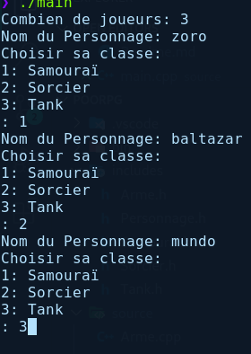
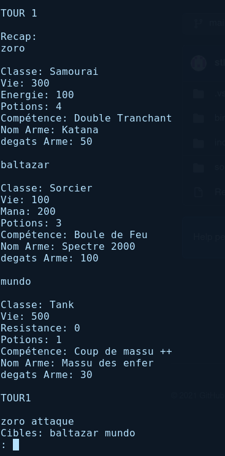
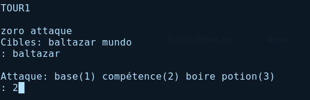

# TP: MINI RPG C++

## introduction:

Il s'agit d'un rpg tour par tour, où chaque utilisateur peut crée son `personnage` et choisir sa classe `exemple: Tank, Sorcier ... `, chaque classe à des` attributs `différents exmeple `le Tank à plus de point de vie et à sa propre compétence`.Le jeux se déroule tour par tour, chaque tour les joueurs peuvent choisir `d'attaquer un autre joueur`, il peuvent choisir une `attaque de base` ou un `compétence`. Il peuvent aussi choisir de prendre une `potion`, le joueurs gagne si les autres sont mort.

## Les classes:

+ Tank
  
  + vie: 500hp
  
  + potion: 1 de 30 hp
  
  + arme: Massu
  
  + degats: 30
  
  + compétence: "coup de Massu++"

+ Sorcier
  
  + vie: 100 hp
  
  + potion: 3
  
  + arme: Spectre 2000
  
  + degats: 100
  
  + compétence: Boule de feu

+ Samouraï:
  
  + vie: 300
  
  + potion: 5
  
  + arme: Katana
  
  + degats: 50
  
  + compétence: "Double Tranchant"

## Exemple d'un partie:

### Phase 1: Nom personnage et  classe

### Phase 2: Caractéristiques Personnage

### Phase 3: Combat

